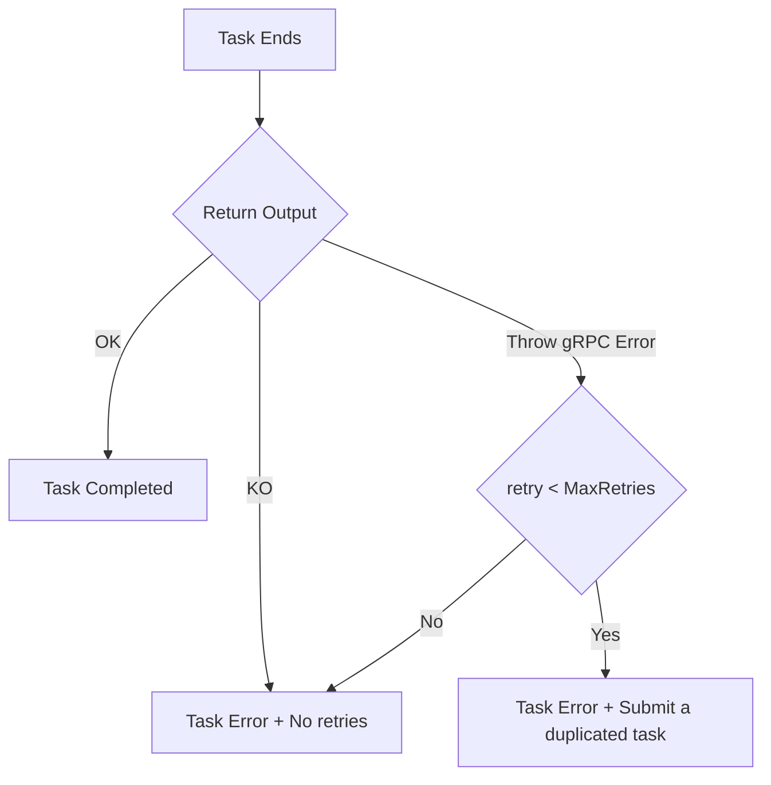
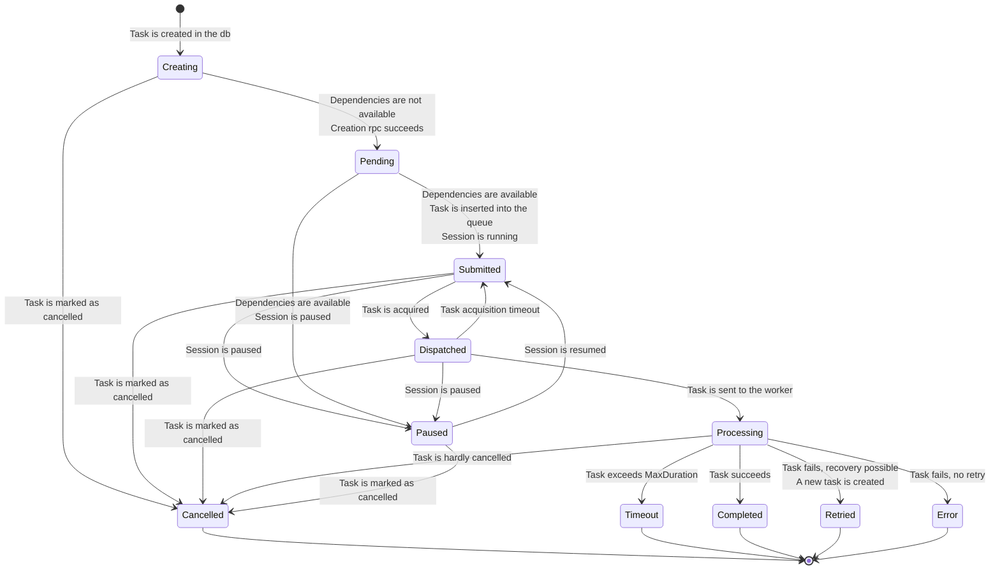
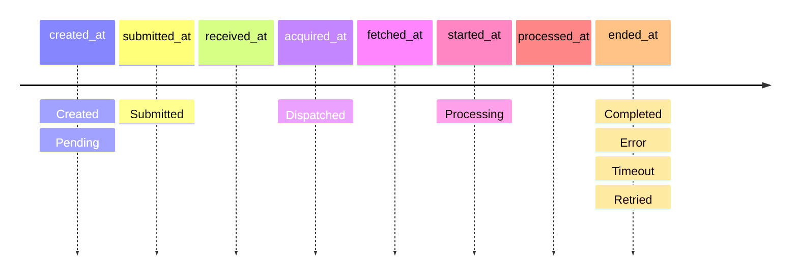

# Tasks

## Task dependencies

ArmoniK supports data dependencies between tasks, it means that a task will be executed only when all their input data are available. The input data can be created by other tasks.

A task cannot directly wait for another tasks since we want to make sure that a task that does nothing (just wait) will not occupy a pod for no reason. Similarly, a task cannot wait for the completion of its child tasks. Child tasks are only submitted when the parent task completes successfully in order to simplify the management of the children when there is an issue during the execution of the parent task.

## Error management

- Task Completed
  - Status Ok
  - Subtask creation OK : child tasks are created when received (with creating status i.e; created "on the fly") and submitted at the end of the parent task
  - Outputs OK
- Task Error
  - Cancellation of outputs and child tasks
  - Error not managed by application (raise a gRPC Error that will be transferred to the polling agent), annulate output from child tasks.
  - creation of Task Duplicate (with link for monitoring and number of retry) and transfer output creation responsibility
- Task resubmission
  - copy of task metadata with new id

## Status state diagram

## Tasks timestamps and statuses

## TaskOptions

TaskOptions define configurable behaviors and limits for individual tasks. They are supplied when creating or resubmitting a task and control how the runtime schedules, retries, and isolates task execution. Default task options are defined when a session is created and are applied to all tasks in that session. These defaults can be overridden by the task options provided when creating an individual task; task-level options take precedence for that task only.
This is a list of TaskOptions with their descriptions :

#### TaskOptions: Options
The Options parameter allows for the transmission of custom-defined options from the client to the task. This flexibility enables various configurations tailored to the specific requirements of the task, accommodating specialized processing needs or adjusting runtime behaviors.

#### TaskOptions: MaxDuration
The MaxDuration parameter specifies the maximum duration allowed for the task to execute. This ensures that tasks do not run indefinitely and provides a mechanism to gracefully handle cases where tasks exceed their expected execution times. If the task runs longer than this duration, it may be forcibly terminated or marked as failed.

#### TaskOptions: MaxRetries
The MaxRetries parameter sets the number of retries allowed for the task in the event of failure. This feature helps ensure task reliability by allowing for automatic re-execution under certain conditions, thus reducing the impact of transient errors or failures.

#### TaskOptions:  Priority

As previously exposed, a task is in Pending state while its dependencies are unavailable. Once dependencies are ready the task is inserted into a high-performance queue to be acquired by a scheduling agent. The Priority is a numeric hint that affects the ordering the agent uses when picking (acquiring) tasks from that queue: higher-priority tasks are acquired before lower-priority ones.

#### TaskOptions: PartitionId

The PartitionId parameter indicates the partition in which the task is executed. 

#### TaskOptions: ApplicationName
The ApplicationName parameter transmits the name of the application as defined by the client.

#### TaskOptions: ApplicationVersion
The ApplicationVersion parameter indicates the version of the application that is associated with the task.

#### TaskOptions: ApplicationNamespace
The ApplicationNamespace parameter represents the namespace of the application that is transmitted alongside the task.

#### TaskOptions: ApplicationService
The ApplicationService parameter denotes the service of the application from which the task originates.

#### TaskOptions: EngineType
The EngineType parameter specifies the type of engine that is associated with the task, as defined by the client.
