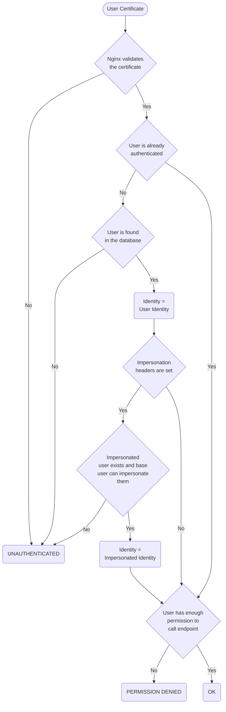

# Authentication and Authorization

## User authentication in ArmoniK

ArmoniK supports user authentication to increase the level of security, to allow different kinds of access to allowed users and to record the usage of the system. It uses **mTLS** to authentify a user with their user certificate.
This authentication is done at 2 levels :

- **Certificate level authentication**: the ingress in front of ArmoniK checks the validity of the user certificate. If validated, it sends the Common Name (CN) and Fingerprint of the certificate as headers to the underlying service
- **Header level authentication**: the received headers are checked against a user database. If the user exists, it is authenticated with the corresponding internal user identity.

A user identity is the representation of a user and their permissions inside the system after the user has been authenticated. This authentication can be accomplished using either of the following schemes:

- **Certificate based scheme**: the user identity corresponds to a specific certificate, which CN and Fingerprint are stored in the database.
- **CN based scheme**: the user identity corresponds to the CN of a certificate. If the database contains an entry where only the CN is specified, it will match any valid certificate with this CN, unless it also matches an entry with both CN and Fingerprint in which case the Certificate Based Scheme has priority.
- **Impersonation scheme**: the user identity corresponds to the user chosen via specific headers in the request. This is possible only if the certificate used matches a user, through a Certificate or CN scheme, who has the permissions required to impersonate the chosen user. See the [Impersonation](3.authentication.md#impersonation) section for details.

## Impersonation

ArmoniK allows users to impersonate other users by adding an impersonation header in their request. A user can use this feature if they already managed to pass a Certificate based scheme or a CN based scheme, then they must have impersonation permissions targetting **all** of the target's roles. If at least one of the roles of the target user is not covered by the base user's impersonate permissions, impersonation fails. If they can impersonate the target user, then the user identity used is the impersonated one. Permissions and roles of the original user are **not** inherited by the impersonated user. If a user attempts to impersonate a nonexistant user, or a user for which they don't have have the proper rights, the authentication fails and does not fall back to the base user. Subsequent API calls done after this impersonation are seen by the rest of the system as if it was the impersonated user who made them. Impersonation is logged for auditing purposes.

## User permissions

ArmoniK uses a User-Role-Permission based approach to handle authorization. Each user in the database can have a set of **Roles**. Each role contains a set of **Permissions**. A user cannot receive permissions directly, instead roles containing the permissions have to be created and given to the user. A permission is defined as a string in a specific format.
The current version handles the following types of permissions :
|Format|Example|Parameters|Description|
---|---|---|---|
``General:Impersonate:<Rolename>``|``General:Impersonate:Monitoring``|**Rolename**: Name of a role|Grants the right to impersonate a user with the role named \<Rolename\>. See [Impersonation](3.authentication.md#impersonation) for details|
|``<Service>:<Name>``|``Submitter:CreateSession``|**Service**: Name of an ArmoniK web service<br>**Name**: Name of the endpoint|Grants the right to use the endpoint named \<Name\> of the service named \<Service\>|
|``<Service>:<Name>:<Target>``|``Submitter:CancelSession:Self``|**Service**: Name of an ArmoniK web service<br>**Name**: Name of the endpoint<br>**Target**: Target or scope of the permission|Same as ``<Service>:<Name>`` as ``<Target>`` is currently unused|

## User authorization

When an user sends a request to an endpoint, they need to be authenticated, and they need the permission to use this endpoint. If they lack the permission, then they will be forbidden from using it.

## Request authorization flowchart



## User administration

Users, roles, permissions and certificates are stored and managed in a database. Administrators in charge of handling user permissions can refer to this section to manage user permissions.

### Authentication database deployments

The following database deployments can be used to handle authentication data :

- Internal MongoDB
- External MongoDB (Currently not supported)
- External SQL (Currently not supported)

### Populating the internal MongoDB when deploying ArmoniK

> **NOTE :** This is the current recommended method

You can define the users' roles and certificates using a json configuration during deployment. Check the [ArmoniK Authentication Configuration Guide](https://github.com/aneoconsulting/ArmoniK/blob/main/.docs/content/2.guide/1.how-to/how-to-configure-authentication.md) for more details.

### Using MongoDB directly

<!-- TODO: could be converted to ::alert -->
> **NOTE :** Using a MongoDB instance different from the one used in the rest of ArmoniK is currently not supported
> **NOTE :** If the deployment used is the internal MongoDB, to send commands to the database you need to use a script like the one available [here](https://github.com/aneoconsulting/ArmoniK/blob/main/tools/access-mongo-as-user.sh) to connect to the database as a user. Another script to connect to the database as admin is available [here](https://github.com/aneoconsulting/ArmoniK/blob/main/tools/access-mongo-as-admin.sh).
> **NOTE :** This method is available to anyone having access to the deployed cluster's secrets and an access to the MongoDB host and port. **Use it at your own risk**.

In order to function properly, the MongoDB database needs to have the following collections:

- AuthData
  - Handles the association between certificates and users
  - Requires the following fields:
    - UserId : _id field of the UserData object associated with this certificate
    - CN : Certificate's Common name
    - Fingerprint : null if this entry should match all certificates with the given CN, otherwise, the certificate's fingerprint
  - The CN and Fingerprint fields form a unique compound index.
- UserData
  - Handles the association between a user and its roles
  - Requires the following fields
    - Username : Unique user name
    - Roles : list of objectIds, each matching the _id field in RoleData of the roles given to the user
- RoleData
  - Handles the association between a role and its permissions
  - Requires the following fields
    - RoleName : Unique role name
    - Permissions : list of strings corresponding to the permissions of the role

#### Insert a role

To insert a role with the name "Role1" granting the permissions "Submitter:ListTasks" and "General:Impersonate:Role2", use the following command :

```javascript
db.RoleData.insertOne({RoleName:"Role1", Permissions:["Submitter:ListTasks", "General:Impersonate:Role2"]})
```

See the [MongoDB documentation](https://www.mongodb.com/docs/manual/reference/method/db.collection.insertOne/) to get the RoleId (_id field) of the inserted role from the command's response.

#### Insert a user

To insert a user with the name "User1" with the role "Role1", use the following command :

```javascript
db.UserData.insertOne({User:"User1", Roles:["Role1"]})
```

See the [MongoDB documentation](https://www.mongodb.com/docs/manual/reference/method/db.collection.insertOne/) to get the UserId (_id field) of the inserted user from the command's response.

#### Insert a certificate

To insert a certificate with Common Name "CN1" and Fingerprint "FP1" associated with the user with UserId "62f4efe6d82645e26e09584f", use the following command :

```javascript
db.AuthData.insertOne({UserId:"62f4efe6d82645e26e09584f", CN:"CN1", Fingerprint:"FP1"})
```

To insert an entry matching all certificates with Common Name "CN1" associated with user with UserId "62f4efe6d82645e26e09584f", use the following command :

```javascript
db.AuthData.insertOne({UserId:"62f4efe6d82645e26e09584f", CN:"CN1"})
```

#### Edit a user/role/certificate

Refer to [this link](https://www.mongodb.com/docs/manual/reference/method/db.collection.findOneAndUpdate/) for the procedure to update MongoDB entries. When updating a Role's name, please make sure to also update the associated impersonation permission's value.

#### Deleting a user/role/certificate

Refer to [this link](https://www.mongodb.com/docs/manual/reference/method/db.collection.findOneAndDelete/) for the procedure to delete MongoDB entries.

### Using SQL directly

Currently not implemented

### Using the User Administration gRPC service

Currently not implemented
