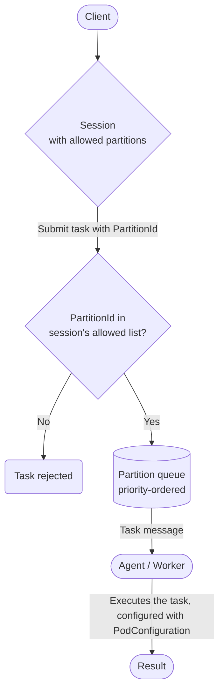

# Partitions

## What is a partition?

A **partition** is a logical namespace in ArmoniK that groups a set of agent/worker couples and controls
how tasks are routed to them. Every task is assigned to exactly one partition, and a
**session** declares upfront which partitions its tasks are allowed to use.

Partitions serve two complementary purposes:

- **Resource management**: each partition defines how many agent/worker couples are reserved for it and
  how many it may use at most, enabling multi-tenant deployments where different workloads have
  guaranteed capacity.
- **Task routing**: tasks are dispatched to the partition-specific message queue, so only
  workers subscribed to that partition will pick them up.

## Partition properties

### Identity

Each partition is identified by a unique **`PartitionId`** string, which is what clients use when
creating sessions and submitting tasks. A list of **`ParentPartitionIds`** records the chain of
ancestor partitions from the direct parent up to the root; this is used to express partition
hierarchies (e.g. a specialised partition that belongs to a broader resource pool). Fields other 
than **`PartitionId`** are not used. They are only there as an indication. They do not have default
values.

### Capacity and scheduling

Three numeric properties govern how the scheduler allocates pods to a partition:

- **`PodReserved`** is the number of agent/worker couples kept permanently available for this
  partition. It acts as a soft floor, ensuring that at least this much capacity is always
  dedicated to the partition regardless of other workloads running concurrently.
- **`PodMax`** is the hard upper bound on the number of agent/worker couples the partition may
  use at once. The scheduler ignores partitions whose `PodMax` is 0, so setting it to 0 is a
  convenient way to disable a partition without removing it.
- **`PreemptionPercentage`** (0–100) controls how much of the partition's capacity can be
  reclaimed when higher-priority work needs resources. A value of 0 means the partition is
  never preempted; 100 means it can be fully preempted.
- **`Priority`** determines the partition's relative importance when the scheduler must choose
  between competing partitions. Higher values take precedence.

### Pod configuration

**`PodConfiguration`** is an optional free-form dictionary of key-value pairs that is forwarded
to every agent/worker couple running in the partition. Use it to express hardware requirements,
environment settings, or any other deployment-specific parameters that workers in this partition
need (for example, the type of GPU accelerator to request).

## Session and task binding

When a **session** is created, the client provides a list of allowed `PartitionIds`. All tasks
submitted within that session must reference one of those partitions. A default partition is also
set at the session level and used when the task does not specify one explicitly.

At task submission time, ArmoniK validates that the task's `PartitionId` belongs to the session's
allowed list. If the partition is not allowed, the task is rejected.

Once validated, the task is pushed to the partition's dedicated message queue. Agents
subscribed to that partition dequeue and send the tasks work their associated worker for execution.

## Task routing flowchart



## Partition administration

### Overview

Partitions are initialised at startup from the `Partitioning` section of the `InitServices`
configuration.
Each partition is provided as a JSON string that is deserialised and inserted into the database.

> **NOTE :** Partition definitions are loaded during initialisation. To modify a partition
> after deployment, update the configuration and re-run initialisation as described in
> [Editing a partition](#editing-a-partition).

### JSON format

A partition JSON object has the following structure:

```json
{
  "PartitionId": "default",
  "ParentPartitionIds": [],
  "PodReserved": 1,
  "PodMax": 10,
  "PreemptionPercentage": 50,
  "Priority": 2,
  "PodConfiguration": {
    "key": "value"
  }
}
```

`PodConfiguration` may be omitted or left empty when no specific pod settings are required.

### Configuring partitions via environment variables

Partitions are provided as indexed environment variables under
`InitServices__Partitioning__Partitions`. Each variable holds a serialised JSON string for one
partition.

```bash
InitServices__Partitioning__Partitions__0=<json string for the first partition>
InitServices__Partitioning__Partitions__1=<json string for the second partition>
```

#### Example: a default partition and a GPU partition

The following example defines two partitions: `default` for general-purpose workloads and `gpu`
for compute-intensive tasks that require a dedicated, higher-priority pool of pods.

```bash
InitServices__Partitioning__Partitions__0='{"PartitionId":"default","ParentPartitionIds":[],"PodReserved":1,"PodMax":10,"PreemptionPercentage":50,"Priority":2,"PodConfiguration":{}}'
InitServices__Partitioning__Partitions__1='{"PartitionId":"gpu","ParentPartitionIds":[],"PodReserved":2,"PodMax":20,"PreemptionPercentage":20,"Priority":5,"PodConfiguration":{"accelerator":"nvidia-tesla-v100"}}'
```

### Editing a partition

To update a partition's properties, edit the corresponding `InitServices__Partitioning__Partitions__N`
environment variable with the updated JSON and redeploy with initialisation enabled
(`InitServices__InitDatabase=true`). ArmoniK will overwrite the stored partition with the new values.

### Deleting a partition

To remove a partition, delete its MongoDB document. Refer to the
[MongoDB `findOneAndDelete` documentation](https://www.mongodb.com/docs/manual/reference/method/db.collection.findOneAndDelete/)
for the procedure.

> **NOTE :** Deleting a partition while sessions or tasks reference it will cause those tasks to
> be rejected at submission time.

## Querying partitions via the API

ArmoniK exposes two gRPC endpoints for partitions:

| Endpoint         | Permission required         | Description                                                             |
|------------------|-----------------------------|-------------------------------------------------------------------------|
| `GetPartition`   | `Partitions:GetPartition`   | Returns the full metadata of a single partition identified by its ID.   |
| `ListPartitions` | `Partitions:ListPartitions` | Returns a paginated, optionally filtered and sorted list of partitions. |

Both endpoints return `PartitionRaw` objects containing all fields described in the
[Partition properties](#partition-properties) section.
