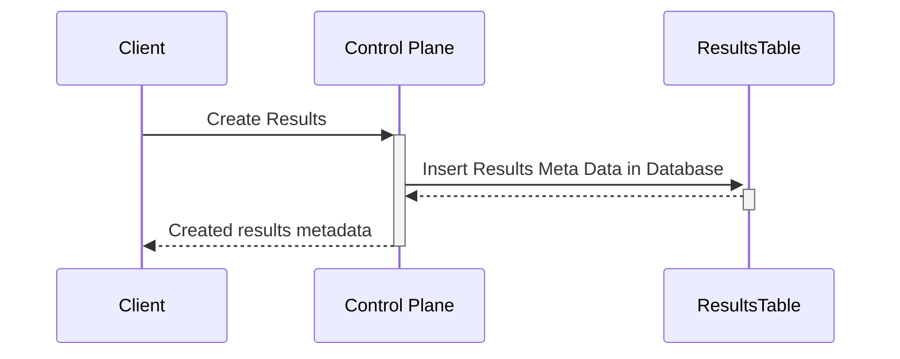
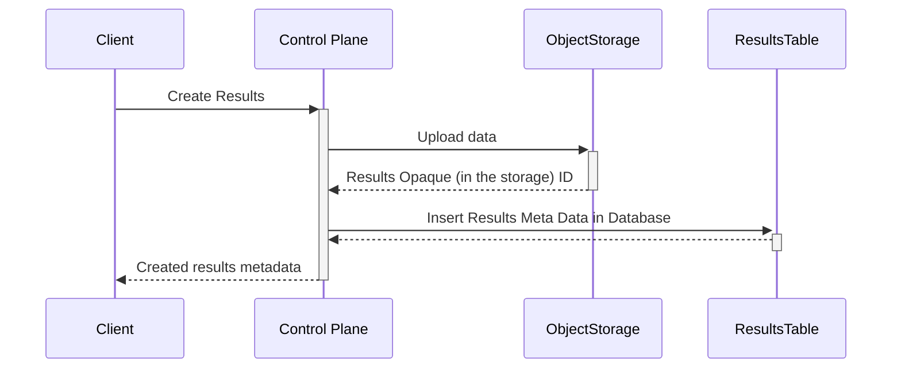
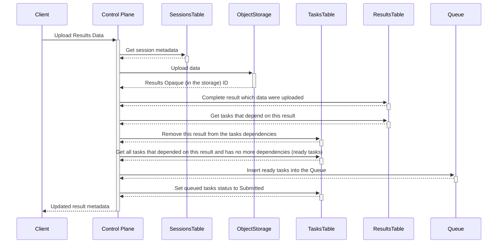
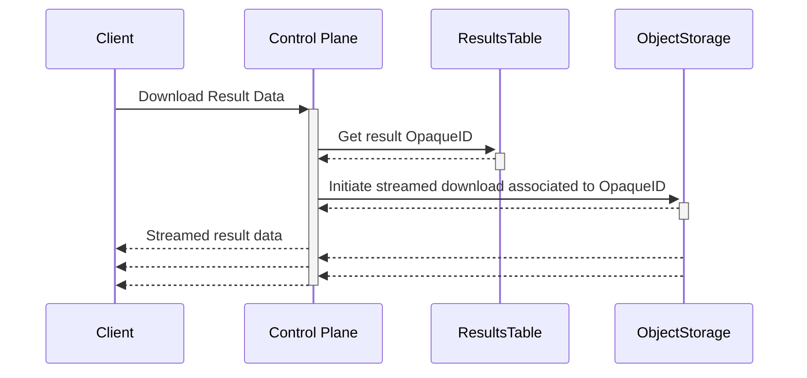
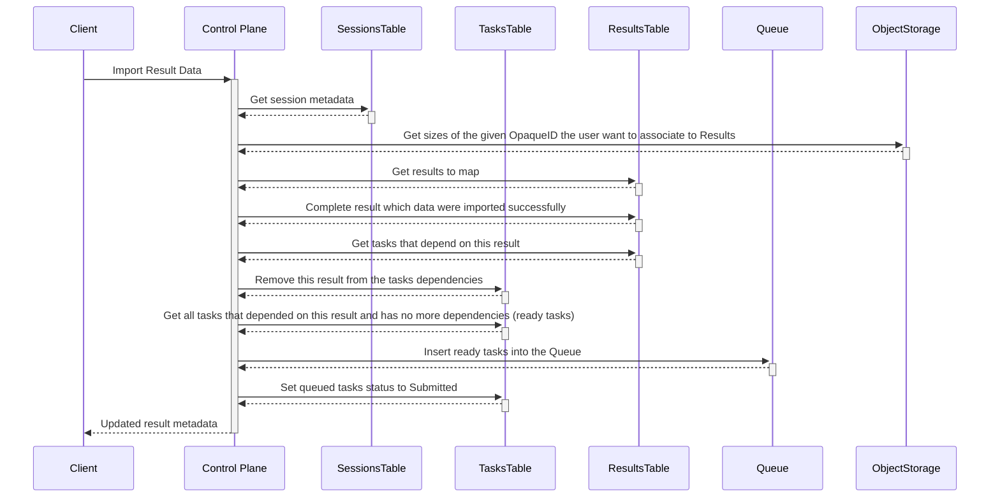

# Results Service RPCs actions

## Create Results Metadata

The following sequence diagram illustrates the internal interactions when creating results metadata in the Results Service:

## Create Results

The following sequence diagram illustrates the internal interactions when creating results metadata with their binary data in the Results Service:

## Upload Results Data

The following sequence diagram illustrates the internal interactions when uploading binary data associated to an already existing Result in the Results Service:

## Download Result Data

The following sequence diagram illustrates the internal interactions when downloading results data from the object storage in the Results Service:

## Import Results Data

The following sequence diagram illustrates the internal interactions when importing existing data into a Result in the Results Service:

