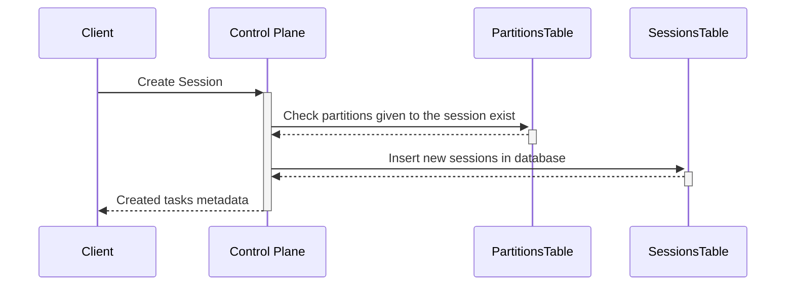
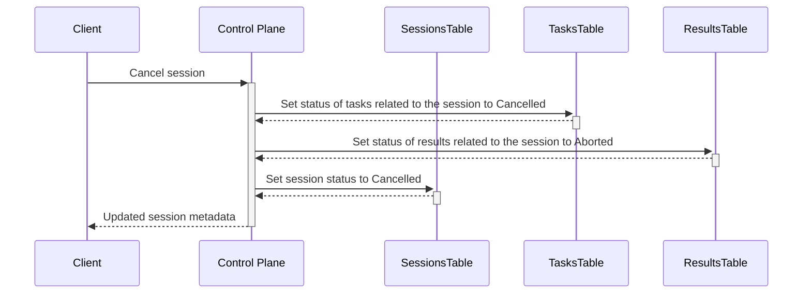
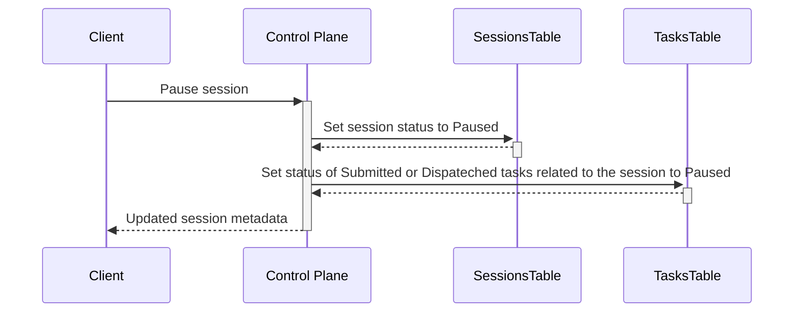
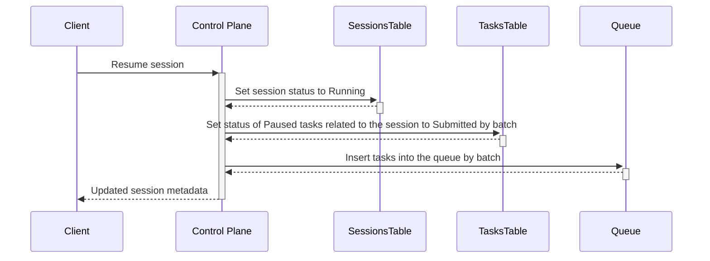
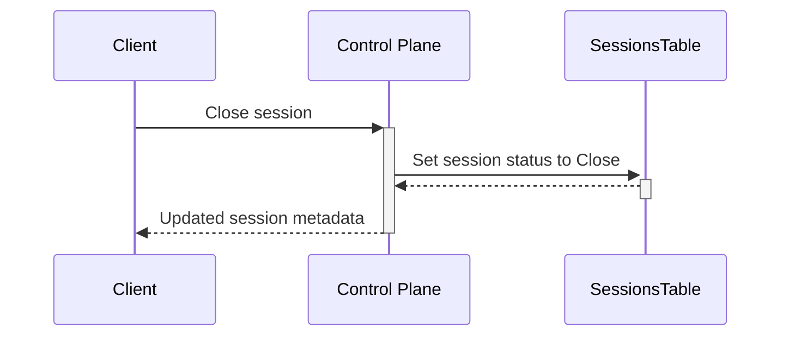
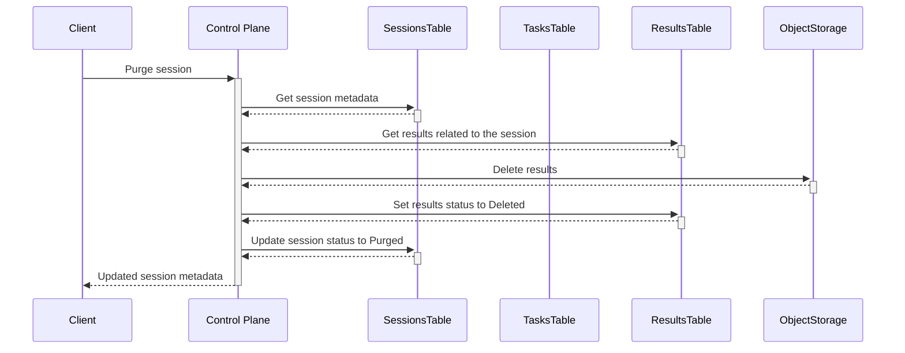
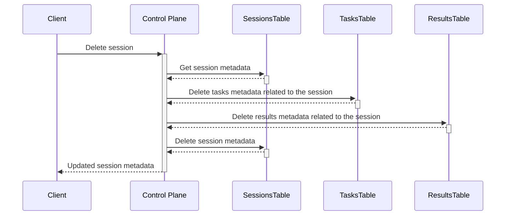
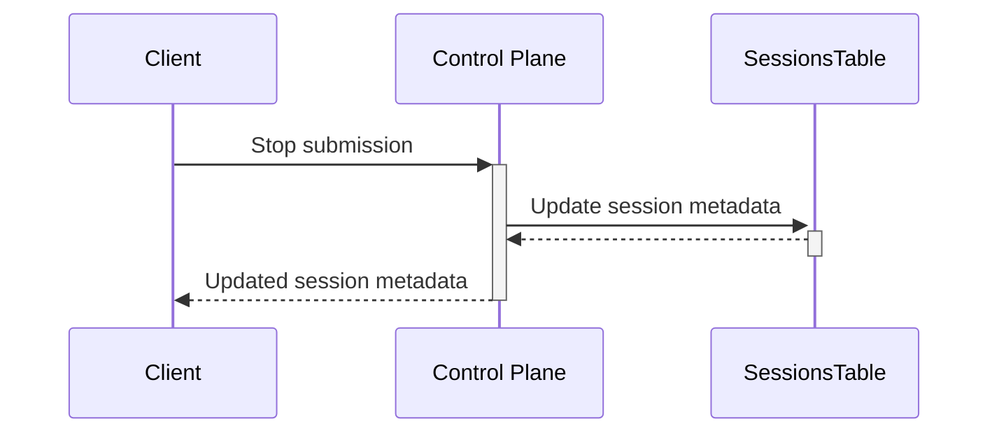

# Sessions Service RPCs actions

For more information on session lifecycle, see our [AEP](https://github.com/aneoconsulting/ArmoniK.Community/blob/main/AEP/aep-00003.md) on the subject.

## Create Session

The following sequence diagram illustrates the internal interactions when creating sessions in the Sessions Service:

## Cancel Session

The following sequence diagram illustrates the internal interactions when cancelling a session in the Sessions Service:

## Pause Session

The following sequence diagram illustrates the internal interactions when pausing sessions in the Sessions Service:

## Resume Session

The following sequence diagram illustrates the internal interactions when resuming sessions in the Sessions Service:

## Close Session

The following sequence diagram illustrates the internal interactions when closing sessions in the Sessions Service:

## Purge Session

The following sequence diagram illustrates the internal interactions when purging sessions in the Sessions Service:

## Delete Session

The following sequence diagram illustrates the internal interactions when deleting sessions in the Sessions Service:

## Stop submission

The following sequence diagram illustrates the internal interactions when stopping sessions in the Sessions Service:

