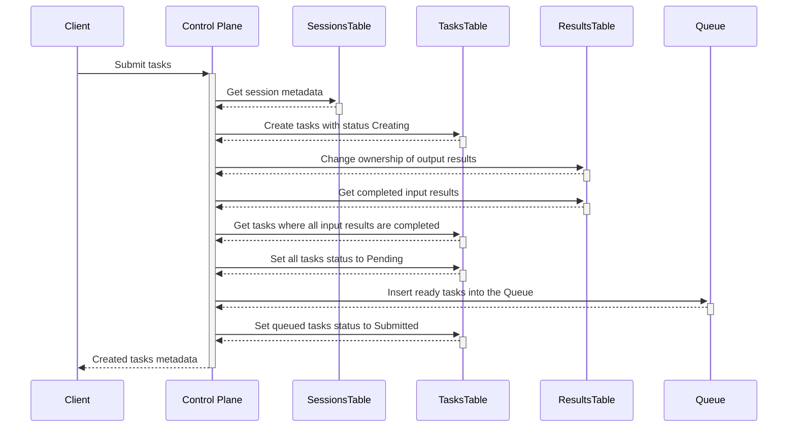
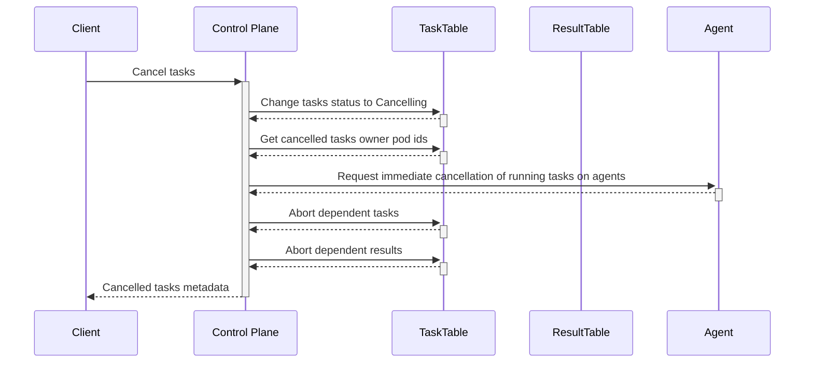

# Tasks Service RPCs actions

## Submit tasks

The following sequence diagram illustrates the internal interactions when submitting tasks in the Tasks Service:

1. **Client Request**: The client sends a request to the Control Plane to submit tasks.
2. **Get Session Metadata**: The Control Plane retrieves the session metadata from the SessionsTable.
3. **Create Tasks**: The Control Plane creates tasks in the TasksTable with the status "Creating".
4. **Change Ownership of Output Results**: The Control Plane updates the ownership of the output results in the ResultsTable.
5. **Get Completed Task Input Results**: The Control Plane retrieves the completed task input results from the ResultsTable.
6. **Get Tasks with Completed Input Results**: The Control Plane retrieves tasks from the TasksTable where the input results are completed.
7. **Set Tasks Status to Pending**: The Control Plane updates the status of all tasks to "Pending" in the TasksTable.
8. **Insert Ready Tasks into the Queue**: The Control Plane inserts the ready tasks into the Queue.
9. **Set Queued Tasks Status to Submitted**: The Control Plane updates the status of the queued tasks to "Submitted" in the TasksTable.
10. **Response to Client**: The Control Plane sends the metadata of the created tasks back to the client.

## Cancel tasks

The following sequence diagram illustrates the internal interactions when canceling tasks in the Tasks Service:

1. **Client Request**: The client sends a request to the Control Plane to cancel tasks.
2. **Change Task Status**: The Control Plane updates the status of the tasks in the TaskTable to "Cancelling".
3. **Get Owner Pod IDs**: The Control Plane retrieves the owner pod IDs of the cancelled tasks from the TaskTable.
4. **Activate Cancellation on Agents**: The Control Plane sends a request to the Agents to cancel the running tasks.
5. **Abort Dependent Tasks**: The Control Plane aborts any dependent tasks in the TaskTable.
6. **Abort Dependent Results**: The Control Plane aborts any dependent results in the ResultTable.
7. **Response to Client**: The Control Plane sends the metadata of the cancelled tasks back to the client.
