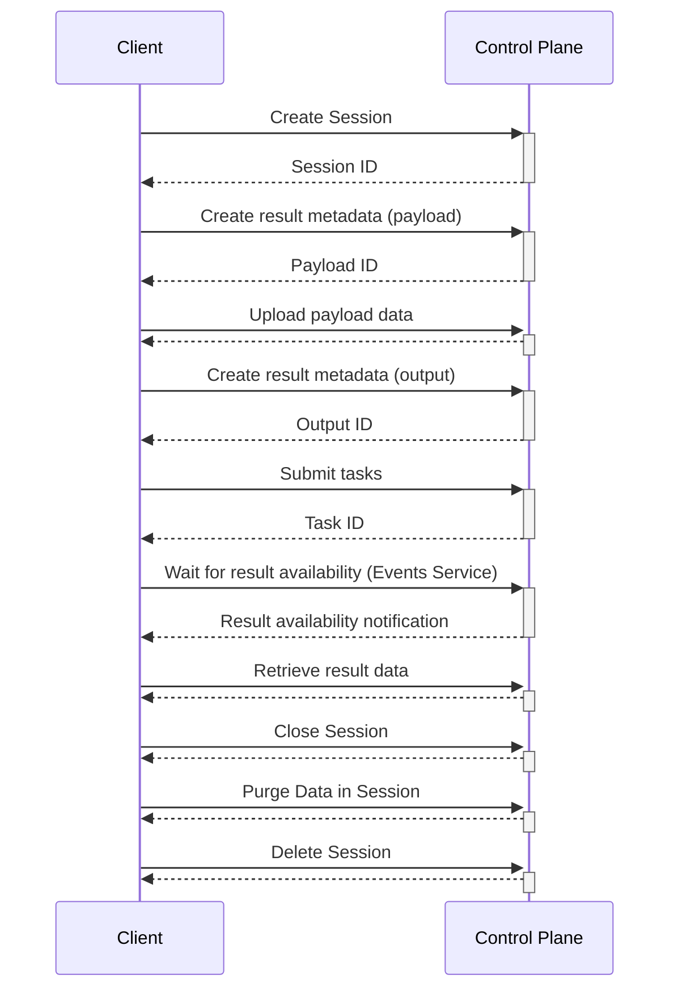
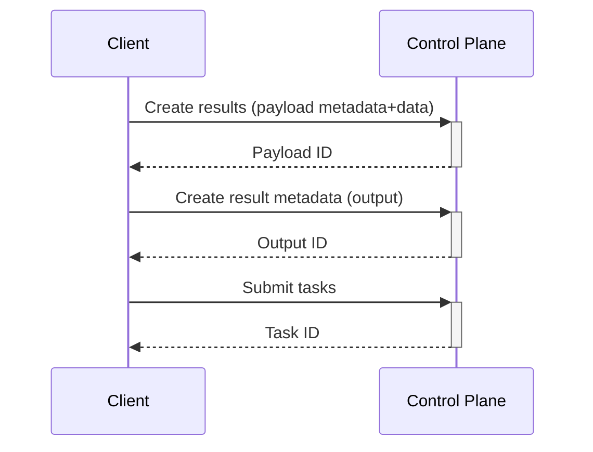
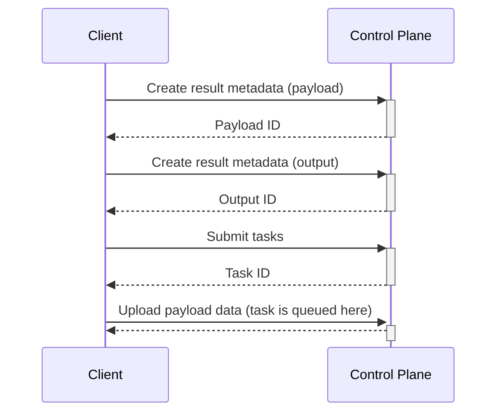
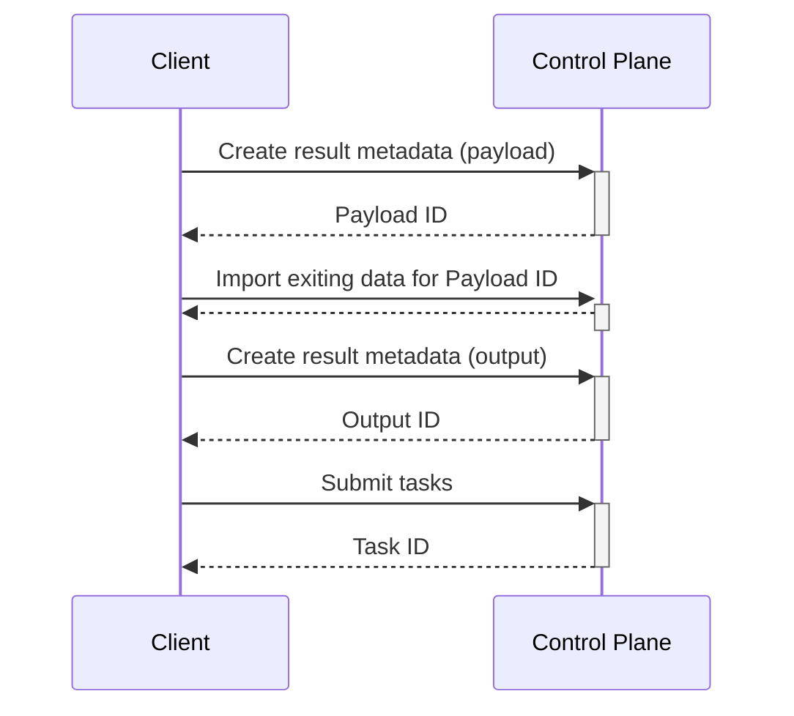
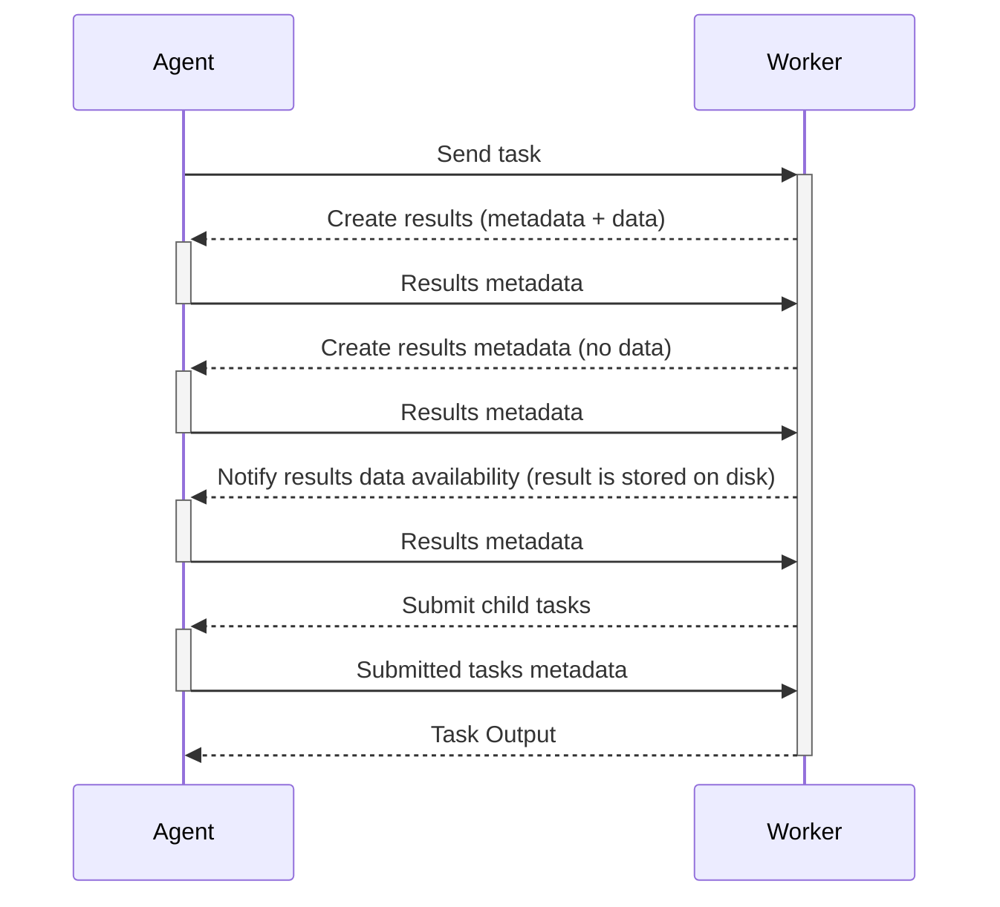

# How to use ArmoniK RPCs

## Client

This diagram illustrates the typical interactions between a client and the control plane for managing sessions, submitting tasks, and retrieving results. It covers the lifecycle of a session, including creating, submitting, and closing tasks.

## Payload and metadata

This diagram demonstrates how a client creates payloads and metadata, submits tasks, and receives task metadatas. It focuses on the relationship between payloads, metadata, and task submission.

## Delayed payload upload

This diagram explains the process of submitting tasks with delayed payload uploads. It shows how tasks are not queued until its dependencies including the payload are not ready.

## Import existing data from object storage

This diagram describes how a client can import existing data from object storage by associating it with a payload ID and submitting tasks based on that data.

## Agent/Worker

This diagram outlines the interactions between an agent and a worker. It includes task distribution, result creation, child task submission, and result notifications.
