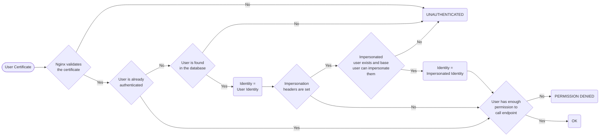

# Authentication and Authorization

## User authentication in ArmoniK

ArmoniK supports user authentication to increase the level of security. It uses **mTLS** to authentify a user with their user certificate.
This authentication is done at 2 levels :
- **Certificate level authentication**: the ingress in front of ArmoniK checks the validity of the user certificate. If validated, it sends the Common Name (CN) and Fingerprint of the certificate as headers to the underlying service
- **Header level authentication**: the received headers are checked against a user database. If the user exists, it is authenticated with the corresponding internal user identity.

Regarding the user identity, and thus permissions, used by the service after authentication, ArmoniK supports the following :
- **Certificate based scheme**: the user identity corresponds to a specific certificate, which CN and Fingerprint are stored in the database.
- **CN based scheme**: the user identity corresponds to the CN of a certificate. If the database contains an entry where only the CN is specified, it will match any valid certificate with this CN, unless it also matches an entry with both CN and Fingerprint in which case the Certificate Based Scheme has priority.
- **Impersonation scheme**: the user identity corresponds to the user chosen via specific headers in the request. This is possible only if the certificate used matches a user, through a Certificate or CN scheme, who has the permissions required to impersonate the chosen user. See the [Impersonation](#impersonation) section for details. 

## Impersonation

ArmoniK allows users to impersonate other users by adding an impersonation header in their request. A user can use this feature if they already managed to pass a Certificate based scheme or a CN based scheme, then they must have impersonation permissions targetting **all** of the target's roles. If at least one of the roles of the target user is not covered by the base user's impersonate permissions, impersonation fails. If they can impersonate the target user, then the user identity used is the impersonated one. Permissions and roles of the original user are **not** inherited by the impersonated user. If a user attempts to impersonate a nonexistant user, or a user for which they don't have have the proper rights, the authentication fails and does not fall back to the base user. 

## User permissions

ArmoniK uses a User-Role-Permission based approach to handle authorization. Each user in the database can have a set of **Roles**. Each role contains a set of **Permissions**. You cannot add permissions directly to a user. A permission is defined as a string in a specific format.
The current version handles the following types of permissions :
|Format|Example|Parameters|Description|
---|---|---|---|
``General:Impersonate:<Rolename>``|``General:Impersonate:Monitoring``|**Rolename**: Name of a role|Grants the right to impersonate a user with the role named \<Rolename\>. See [Impersonation](#impersonation) for details|
|``<Service>:<Name>``|``Submitter:CreateSession``|**Service**: Name of an ArmoniK web service **Name**: Name of the endpoint|Grants the right to use the endpoint named \<Name\> of the service named \<Service\>|
|``<Service>:<Name>:<Target>``|``Submitter:CancelSession:Self``|**Service**: Name of an ArmoniK web service **Name**: Name of the endpoint **Target**: Target or scope of the permission|Same as ``<Service>:<Name>`` as \<Target\> is currently unused|

## User authorization
When an user sends a request to an endpoint, they need to be authenticated, and they need the permission to use this endpoint. If they lack the permission, then they will be forbidden from using it.

## Request authorization flowchart

