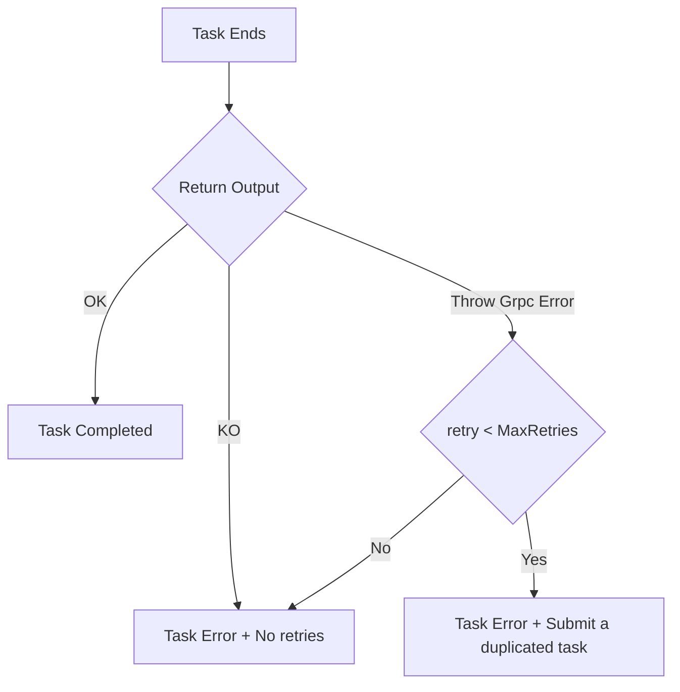

# Tasks

## Task dependencies

ArmoniK supports data dependencies between tasks i.e., tasks will be executed only when their input data are available. The input data can be created by other tasks.

A task cannot directly wait for another tasks since we want to make sure that a task that does nothing (just wait) will not occupy a pod for no reason. For the same reason, a task cannot wait for the completion of its subtasks. Child tasks are only submitted when the parent task completes successfully in order to simplify the management of the children when there is an issue during the execution of the parent task.

## Error management

- Task Completed
  - Status Ok
  - Subtask creation OK : child tasks are created when received (with creating status i.e; created "on the fly") and submitted at the end of the parent task
  - Outputs OK
- Task Error
  - Cancellation of outputs and child tasks
  - Error not managed by application (raise a gRPC Error that will be transfered to the polling agent), annulate output from child tasks.
  - creation of Task Duplicate (with link for monitoring and number of retry) and transfer output creation responsibility
- Task resubmission
  - copy of task metadata with new id
